# 🗡️ DB-Forge MK1

<div align="center">

**Modern Database-as-a-Service Platform with Complete Data Sovereignty**

[](https://opensource.org/licenses/MIT)
[](https://www.docker.com/)
[](https://nextjs.org/)
[](https://fastapi.tiangolo.com/)
[](https://www.python.org/)
[](https://www.typescriptlang.org/)

[**🚀 Live Demo**](#-quick-start) • [**📚 Documentation**](docs/) • [**🧰 Client SDKs**](https://github.com/Trafexofive/DB-Forge-Clients) • [**💬 Discussions**](https://github.com/Trafexofive/DB-Forge-MK1/discussions)

</div>

---

## 🌟 Overview

**DB-Forge MK1** is a production-ready Database-as-a-Service platform that empowers developers with on-demand, isolated database instances while maintaining complete data sovereignty. Built with modern technologies and developer experience in mind.

### ✨ **Why DB-Forge?**

- 🔒 **Data Sovereignty** - Your data stays on your infrastructure, always
- 🚀 **Instant Provisioning** - Create isolated databases in seconds via API
- 🎯 **Developer-First** - Rich APIs, SDKs, and intuitive web interface
- 🛡️ **Enterprise-Ready** - Secure isolation, monitoring, and management
- 🌐 **Self-Hosted** - Deploy anywhere, own your database infrastructure

---

## 🏗️ Architecture

```mermaid
graph TB
    UI[🎨 Next.js Dashboard] --> Proxy[🔀 Traefik Proxy]
    API[⚡ FastAPI Gateway] --> Proxy
    
    Proxy --> Workers[🗄️ Database Workers]
    Workers --> SQLite1[💾 SQLite DB 1]
    Workers --> SQLite2[💾 SQLite DB 2]
    Workers --> SQLiteN[💾 SQLite DB N]
    
    SDK[🧰 Client SDKs] --> API
    CLI[💻 CLI Tools] --> API
    TUI[🖥️ Terminal UI] --> API
```

<div align="center">



</div>

### **Core Components**

| Component | Technology | Purpose |
|-----------|------------|---------|
| **Frontend** | Next.js 15, React 19, Tailwind CSS | Professional admin dashboard |
| **API Gateway** | FastAPI, Python 3.11 | REST API and business logic |
| **Proxy** | Traefik | HTTP routing and load balancing |
| **Database Workers** | Docker, SQLite | Isolated database instances |
| **Client SDKs** | Python, C++, TUI | Multi-language integration |

---

## 🚀 Quick Start

### **Prerequisites**
- Docker & Docker Compose
- Make (for convenience commands)
- Git

### **1. Clone & Start**
```bash
git clone https://github.com/Trafexofive/DB-Forge-MK1.git
cd DB-Forge-MK1

# Start the entire platform
make up
```

### **2. Access Interfaces**
- **📊 Admin Dashboard**: http://frontend.db.localhost:8081
- **📖 API Documentation**: http://db.localhost:8081/docs
- **🔀 Traefik Dashboard**: http://localhost:8080/dashboard/

### **3. Create Your First Database**
```bash
# Using API
curl -X POST -H "X-API-Key: development-api-key-12345" \
     -H "Host: db.localhost" \
     "http://localhost:8081/admin/databases/spawn/my-first-db"

# Using Python SDK
pip install dbforge-client
python -c "
from dbforge_client import DBForgeClient
client = DBForgeClient('http://db.localhost:8081', 'development-api-key-12345')
client.create_database('my-first-db')
print('Database created!')
"
```

---

## 🎨 Features

### **🎛️ Professional Admin Dashboard**
- **Real-time Monitoring** - Live database status and system metrics
- **SQL Query Console** - Execute queries with syntax highlighting
- **Database Management** - Create, delete, and manage instances
- **Connection Monitoring** - Track active connections and pools
- **Security Dashboard** - Monitor access and security events
- **System Logs** - Comprehensive logging and search capabilities

### **⚡ RESTful API Gateway**
- **Complete CRUD Operations** - Full database lifecycle management
- **SQL Execution Engine** - Execute arbitrary SQL queries safely
- **Authentication & Authorization** - API key and role-based access
- **Real-time Statistics** - System health and performance metrics
- **Comprehensive Error Handling** - Detailed error responses

### **🧰 Multi-Language SDKs**
- **🐍 Python Client** - Sync/async support, CLI tools, full coverage
- **🔧 C++ Client** - High-performance native implementation  
- **🖥️ TUI Interface** - Interactive terminal-based management
- **📦 More Coming** - Rust, Go, Java clients planned

### **🔒 Security & Isolation**
- **Container Isolation** - Each database in dedicated containers
- **API Authentication** - Secure API key management
- **Network Segmentation** - Isolated container networking
- **Audit Logging** - Complete operation audit trail

---

## 📚 Documentation

### **Quick Links**
- **[🧠 Context Guide](context.md)** - Complete project context for developers/AI
- **[⚡ Quick Reference](QUICK_REFERENCE.md)** - Essential commands and operations
- **[📖 API Documentation](docs/API.md)** - Complete API reference
- **[🏗️ Architecture Guide](docs/ARCHITECTURE.md)** - System design and components
- **[🚀 Deployment Guide](docs/DEPLOYMENT.md)** - Production deployment instructions

### **Developer Resources**
- **[🛠️ Development Setup](docs/DEVELOPMENT.md)** - Local development environment
- **[🤝 Contributing Guide](docs/CONTRIBUTING.md)** - How to contribute
- **[🧪 Testing Guide](docs/TESTING.md)** - Running and writing tests
- **[🔧 Configuration](docs/CONFIGURATION.md)** - Environment and settings

---

## 💻 Usage Examples

### **API Operations**
```bash
# List databases
curl -H "X-API-Key: development-api-key-12345" \
     "http://db.localhost:8081/admin/databases"

# Create database
curl -X POST -H "X-API-Key: development-api-key-12345" \
     "http://db.localhost:8081/admin/databases/spawn/app-db"

# Execute SQL query
curl -X POST -H "X-API-Key: development-api-key-12345" \
     -H "Content-Type: application/json" \
     -d '{"query": "CREATE TABLE users (id INT, name TEXT)"}' \
     "http://db.localhost:8081/api/db/app-db/query"
```

### **Python SDK**
```python
from dbforge_client import DBForgeClient

# Initialize client
client = DBForgeClient(
    base_url="http://db.localhost:8081",
    api_key="development-api-key-12345"
)

# Database operations
client.create_database("my-app")
databases = client.list_databases()

# SQL operations
db = client.get_database("my-app")
db.execute("CREATE TABLE products (id INT PRIMARY KEY, name TEXT, price REAL)")
db.execute("INSERT INTO products (name, price) VALUES (?, ?)", ("Widget", 19.99))

# Query with results
result = db.execute("SELECT * FROM products WHERE price > ?", (10.0,))
for row in result.fetchall():
    print(f"Product: {row['name']} - ${row['price']}")
```

### **C++ SDK**
```cpp
#include <dbforge/client.hpp>
#include <iostream>

int main() {
    // Initialize client
    dbforge::Client client("http://db.localhost:8081", "development-api-key-12345");
    
    // Create and use database
    client.create_database("cpp-app");
    auto db = client.get_database("cpp-app");
    
    // Execute operations
    db.execute("CREATE TABLE inventory (id INT, item TEXT, stock INT)");
    db.execute("INSERT INTO inventory VALUES (?, ?, ?)", 1, "Gadget", 100);
    
    // Query results
    auto result = db.execute("SELECT * FROM inventory");
    for (const auto& row : result) {
        std::cout << "Item: " << row["item"] 
                  << " Stock: " << row["stock"] << std::endl;
    }
    
    return 0;
}
```

---

## 🛠️ Development

### **Available Commands**
```bash
# Core operations
make up              # Start all services
make down            # Stop all services
make restart         # Restart everything
make logs            # View all logs

# Development
make shell-frontend  # Access frontend container
make shell-gateway   # Access backend container
make frontend-build  # Rebuild frontend only
make clean          # Clean build artifacts

# Maintenance
make backup         # Backup databases
make restore        # Restore from backup
make health         # Health check all services
```

### **Project Structure**
```
DB-Forge-MK1/
├── services/                   # Core application services
│   ├── frontend/              # Next.js admin dashboard
│   └── db-gateway/           # FastAPI backend service
├── infra/                     # Infrastructure configuration
│   ├── docker-compose.yml    # Service orchestration
│   ├── traefik/              # Reverse proxy config
│   └── db-worker-base/       # Database worker images
├── docs/                      # Documentation
├── scripts/                   # Automation scripts
├── context.md                 # Complete project context
└── Makefile                   # Development commands
```

### **Technology Stack**

#### **Frontend Stack**
- **Framework**: Next.js 15 with App Router
- **UI Library**: shadcn/ui + Radix UI primitives  
- **Styling**: Tailwind CSS with custom design system
- **Language**: TypeScript with strict type checking
- **State**: React Server Components + Client Components
- **Icons**: Lucide React icon library

#### **Backend Stack**
- **Framework**: FastAPI with Pydantic validation
- **Database**: SQLite with asyncio support
- **Authentication**: API key based with middleware
- **Documentation**: Auto-generated OpenAPI specs
- **Language**: Python 3.11 with type hints
- **Container Runtime**: Docker with optimized images

#### **Infrastructure**
- **Orchestration**: Docker Compose
- **Reverse Proxy**: Traefik with automatic service discovery
- **Networking**: Custom bridge networks with DNS resolution
- **Data Persistence**: Container volumes with backup support
- **Development**: Hot-reload and dev mode support

---

## 🚀 Deployment

### **Development (Local)**
```bash
git clone https://github.com/Trafexofive/DB-Forge-MK1.git
cd DB-Forge-MK1
make up
```

### **Production (Recommended)**
```bash
# Clone repository
git clone https://github.com/Trafexofive/DB-Forge-MK1.git
cd DB-Forge-MK1

# Configure environment
cp infra/.env.example infra/.env
# Edit infra/.env with production settings

# Deploy with production compose
docker-compose -f infra/docker-compose.yml up -d

# Verify deployment
make health
```

### **Docker Swarm / Kubernetes**
See [deployment documentation](docs/DEPLOYMENT.md) for advanced deployment options including:
- Docker Swarm clusters
- Kubernetes manifests  
- Cloud provider configurations
- High availability setups
- SSL/TLS termination
- Backup strategies

---

## 🔗 Related Projects

| Project | Description | Repository |
|---------|-------------|------------|
| **DB-Forge Clients** | Official SDKs and client libraries | [🧰 DB-Forge-Clients](https://github.com/Trafexofive/DB-Forge-Clients) |
| **DB-Forge Helm** | Kubernetes Helm charts | 🔄 *Coming Soon* |
| **DB-Forge Terraform** | Infrastructure as Code modules | 🔄 *Coming Soon* |
| **DB-Forge Extensions** | Community plugins and extensions | 🔄 *Coming Soon* |

---

## 🤝 Contributing

We welcome contributions! DB-Forge MK1 is built for the developer community.

### **Quick Contribution**
1. **Fork** the repository
2. **Create** feature branch: `git checkout -b feature/amazing-feature`
3. **Commit** changes: `git commit -m 'Add amazing feature'`
4. **Push** to branch: `git push origin feature/amazing-feature`
5. **Open** Pull Request

### **Development Areas**
- 🎨 **Frontend**: New dashboard pages, UI components, user experience
- ⚡ **Backend**: API endpoints, performance optimizations, new features  
- 🧰 **SDKs**: New language clients, existing client improvements
- 📚 **Documentation**: Guides, tutorials, API documentation
- 🧪 **Testing**: Unit tests, integration tests, performance benchmarks
- 🔒 **Security**: Authentication improvements, security audits
- 🚀 **DevOps**: CI/CD, deployment automation, monitoring

### **Code Standards**
- **Python**: Follow PEP 8, use type hints, comprehensive docstrings
- **TypeScript**: Strict mode, proper interfaces, ESLint compliance
- **Documentation**: Clear README updates, inline code comments
- **Testing**: Include tests for new features and bug fixes

---

## 📊 Performance & Scalability

### **Benchmarks** *(Development Environment)*
| Metric | Value | Notes |
|--------|-------|-------|
| **Database Creation** | ~2s | Including container startup |
| **Query Execution** | <100ms | Simple SELECT queries |
| **Concurrent Databases** | 50+ | Limited by system resources |
| **API Throughput** | 1000+ req/s | On modern hardware |
| **Memory Usage** | ~500MB | Base platform footprint |

### **Scaling Strategies**
- **Horizontal**: Multiple DB-Forge instances behind load balancer
- **Vertical**: Resource allocation per database worker
- **Storage**: External volume mounts for persistence
- **Networking**: Custom Docker networks for isolation
- **Monitoring**: Prometheus metrics and Grafana dashboards

---

## 🐛 Troubleshooting

### **Common Issues**

**Services Won't Start**
```bash
# Check ports
netstat -tulpn | grep :808[01]

# Clean Docker state
docker system prune -f
make restart
```

**Frontend Connection Issues**
```bash
# Verify Traefik routing
curl -H "Host: frontend.db.localhost" http://localhost:8081/

# Check container logs
docker logs db-forge-frontend
```

**API Authentication Errors**
```bash
# Test API directly
curl -H "X-API-Key: development-api-key-12345" \
     "http://localhost:8081/admin/gateway/stats"
```

**Database Creation Fails**
```bash
# Check Docker socket permissions
ls -la /var/run/docker.sock

# Verify worker base image
docker images | grep db-worker-base
```

For more troubleshooting, see the [troubleshooting guide](docs/TROUBLESHOOTING.md).

---

## 📄 License

This project is licensed under the **MIT License** - see the [LICENSE](LICENSE) file for details.

### **Third-Party Licenses**
- Next.js - MIT License
- FastAPI - MIT License  
- Traefik - MIT License
- shadcn/ui - MIT License
- Docker - Apache 2.0 License

---

## 🙏 Acknowledgments

- **FastAPI** team for the excellent Python web framework
- **Vercel** for Next.js and the modern React ecosystem
- **Radix UI** and **shadcn** for beautiful, accessible UI components
- **Traefik** for powerful reverse proxy capabilities
- **Docker** for containerization platform
- **Open Source Community** for inspiration and best practices

---

<div align="center">

**Built with ❤️ for developers who value data sovereignty and developer experience**

[⭐ **Star this repo**](https://github.com/Trafexofive/DB-Forge-MK1/stargazers) • [🐛 **Report Issues**](https://github.com/Trafexofive/DB-Forge-MK1/issues) • [💬 **Join Discussions**](https://github.com/Trafexofive/DB-Forge-MK1/discussions)

</div>