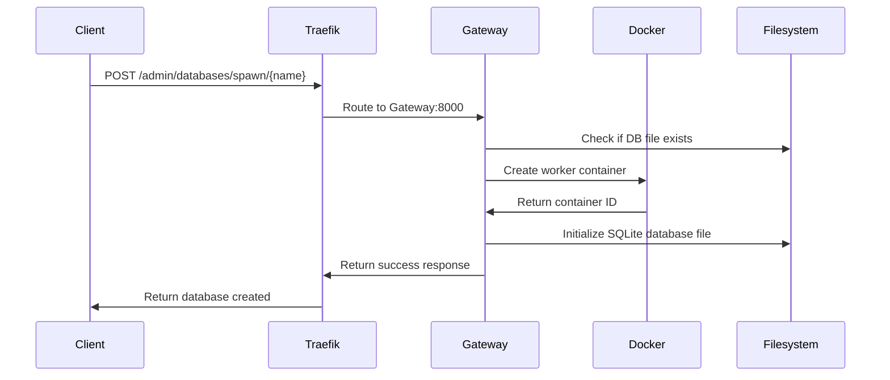
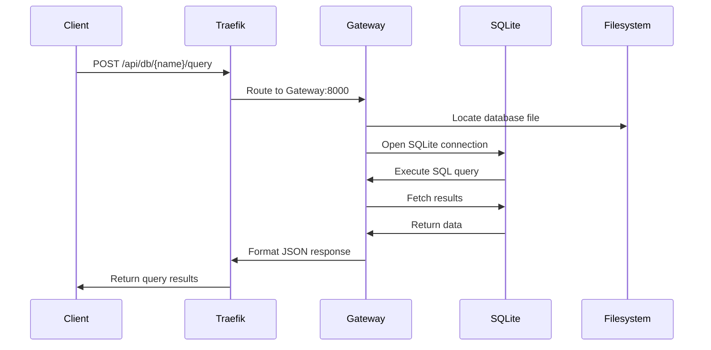
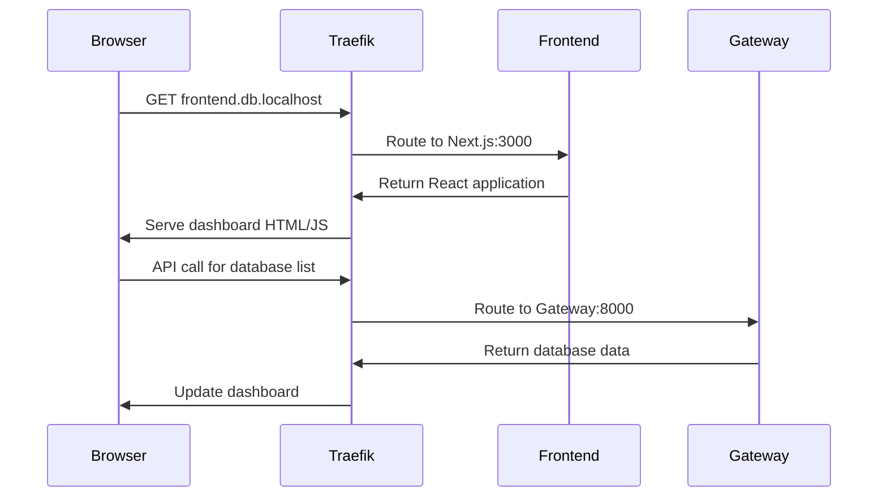

# 🏗️ DB-Forge MK1: Architecture Deep Dive

This document provides a comprehensive overview of the DB-Forge MK1 system architecture, component interactions, design principles, and technical implementation details.

## 🎯 System Overview

DB-Forge MK1 is a modern, containerized Database-as-a-Service platform that combines powerful backend APIs with an intuitive web interface. The architecture follows microservices principles with clean separation of concerns and scalable design patterns.

```
┌─────────────────────────────────────────────────────────────────┐
│                        External Access Layer                    │
│  ┌─────────────────┐  ┌─────────────────┐  ┌─────────────────┐  │
│  │   Web Browser   │  │   API Clients   │  │  Mobile Apps    │  │
│  └─────────────────┘  └─────────────────┘  └─────────────────┘  │
└─────────────────┬───────────────┬───────────────┬───────────────┘
                  │               │               │
┌─────────────────▼─────────────────────────────────▼──────────────┐
│                     Traefik Reverse Proxy                        │
│               http://db.localhost:8081                           │
│  ┌─────────────────┐ ┌─────────────────┐ ┌─────────────────────┐ │
│  │  Route: /api/*  │ │ Route: /docs    │ │ Route: frontend.*   │ │
│  └─────────────────┘ └─────────────────┘ └─────────────────────┘ │
└─────────┬─────────────┬─────────────────┬────────────────────────┘
          │             │                 │
┌─────────▼─────┐ ┌─────▼─────┐ ┌─────────▼─────────┐
│  DB Gateway   │ │API Docs UI│ │    Frontend       │
│   (FastAPI)   │ │ (Swagger) │ │   (Next.js)       │
│   Port: 8000  │ │           │ │   Port: 3000      │
└─────────┬─────┘ └───────────┘ └───────────────────┘
          │
┌─────────▼─────────────────────────────────────────┐
│              Database Worker Pool                 │
│  ┌─────────┐  ┌─────────┐  ┌─────────┐            │
│  │SQLite-1 │  │SQLite-2 │  │SQLite-N │     ...    │
│  │Container│  │Container│  │Container│            │
│  └─────────┘  └─────────┘  └─────────┘            │
└───────────────────────────────────────────────────┘
          │
┌─────────▼─────────────────────────────────────────┐
│              Host Filesystem                      │
│         ./db-data/{database}.db files             │
└───────────────────────────────────────────────────┘
```

## 🧩 Core Components

### 1. Traefik Reverse Proxy

**Purpose**: Intelligent traffic routing and service discovery  
**Technology**: Traefik v2.10  
**Port**: 8080 (dashboard), 8081 (services)

**Responsibilities**:
- **Service Discovery**: Automatically detects services via Docker labels
- **Load Balancing**: Distributes traffic across service instances  
- **SSL Termination**: Handles TLS certificates and encryption
- **Route Management**: Maps URLs to appropriate backend services
- **Health Checks**: Monitors service health and removes unhealthy instances

**Configuration**:
```yaml
# infra/traefik/traefik.yml
entryPoints:
  web-alt:
    address: ":8081"
providers:
  docker:
    exposedByDefault: false
api:
  dashboard: true
  insecure: true
```

**Service Labels Example**:
```yaml
labels:
  - "traefik.enable=true"
  - "traefik.http.routers.db-gateway.rule=Host(`db.localhost`)"
  - "traefik.http.services.db-gateway.loadbalancer.server.port=8000"
```

### 2. DB Gateway (API Service)

**Purpose**: Central orchestration and data operations hub  
**Technology**: FastAPI (Python 3.11+), Docker API, aiosqlite  
**Port**: 8000 (internal), routed via Traefik

**Architecture Layers**:

#### API Layer (`/services/db-gateway/app/`)
```
app/
├── main.py              # FastAPI application entry point
├── routes/
│   ├── admin.py         # Database lifecycle management  
│   ├── data.py          # Data operations (CRUD, queries)
│   └── health.py        # Health checks and monitoring
├── models/
│   ├── requests.py      # Pydantic request models
│   └── responses.py     # Pydantic response models
├── core/
│   ├── database.py      # Database operations and connection management
│   ├── docker_client.py # Docker container orchestration
│   └── config.py        # Application configuration
└── utils/
    ├── auth.py          # Authentication and authorization
    ├── logging.py       # Structured logging
    └── validators.py    # Request validation utilities
```

#### Key Responsibilities:
1. **Container Orchestration**:
   - Spawn/destroy database worker containers
   - Monitor container health and status
   - Manage container networking and volumes

2. **Data Operations**:
   - Execute SQL queries against database files
   - Handle transactions and connection pooling
   - Provide query result formatting and pagination

3. **API Management**:
   - Request validation and sanitization
   - Response formatting and error handling
   - Rate limiting and access control

#### Database Operations Flow:
```python
# Example: Query Execution Flow
async def execute_query(db_name: str, sql: str, params: list = None):
    # 1. Validate database exists
    db_path = f"/databases/{db_name}.db"
    if not os.path.exists(db_path):
        raise DatabaseNotFound(db_name)
    
    # 2. Execute query with connection pooling
    async with aiosqlite.connect(db_path) as conn:
        conn.row_factory = aiosqlite.Row
        cursor = await conn.execute(sql, params or [])
        
        if sql.strip().upper().startswith('SELECT'):
            results = await cursor.fetchall()
            return [dict(row) for row in results]
        else:
            await conn.commit()
            return {"affected_rows": cursor.rowcount}
```

### 3. Frontend (Next.js Application)

**Purpose**: Modern web interface for database management  
**Technology**: Next.js 15, TypeScript, Tailwind CSS, shadcn/ui  
**Port**: 3000 (internal), routed via Traefik

#### Architecture Structure:
```
services/frontend/src/
├── app/                          # Next.js App Router
│   ├── layout.tsx               # Root layout with providers
│   ├── page.tsx                 # Dashboard homepage
│   ├── globals.css              # Global styles + Tailwind
│   └── loading.tsx              # Loading UI components
├── components/
│   ├── ui/                      # shadcn/ui base components
│   │   ├── button.tsx
│   │   ├── card.tsx
│   │   ├── table.tsx
│   │   └── ...
│   ├── dashboard/               # Custom dashboard components
│   │   ├── dashboard-shell.tsx  # Main layout shell
│   │   ├── database-overview.tsx # Database statistics
│   │   ├── connection-monitor.tsx # Live connection tracking
│   │   └── query-editor.tsx     # SQL query interface
│   └── forms/                   # Form components
│       ├── database-form.tsx
│       └── query-form.tsx
├── lib/
│   ├── api.ts                   # API client with error handling
│   ├── utils.ts                 # Utility functions (cn, formatters)
│   ├── hooks/                   # Custom React hooks
│   │   ├── use-databases.ts
│   │   └── use-connections.ts
│   └── types/                   # TypeScript type definitions
│       ├── database.ts
│       └── api.ts
└── styles/
    └── components.css           # Component-specific styles
```

#### Key Features:
1. **Responsive Dashboard**: Mobile-first design with adaptive layouts
2. **Real-time Updates**: WebSocket integration for live data
3. **Type Safety**: Full TypeScript integration with API client
4. **Accessibility**: WCAG compliant with keyboard navigation
5. **Performance**: Optimized builds with standalone output

#### API Integration:
```typescript
// Example: Type-safe API client
class ApiClient {
  private baseUrl: string = process.env.NEXT_PUBLIC_API_URL

  async getDatabases(): Promise<Database[]> {
    const response = await fetch(`${this.baseUrl}/admin/databases`)
    if (!response.ok) throw new ApiError(response)
    return response.json()
  }

  async executeQuery(dbName: string, sql: string): Promise<QueryResult> {
    const response = await fetch(`${this.baseUrl}/api/db/${dbName}/query`, {
      method: 'POST',
      headers: { 'Content-Type': 'application/json' },
      body: JSON.stringify({ sql })
    })
    return response.json()
  }
}
```

### 4. Database Workers (Isolated Containers)

**Purpose**: Isolated execution environments for database instances  
**Technology**: Alpine Linux + SQLite3, minimal footprint  
**Lifecycle**: Ephemeral, managed by DB Gateway

#### Container Specifications:
- **Base Image**: `alpine:latest` (~5MB)
- **Runtime**: SQLite3 command-line tools
- **Memory**: 64MB default, configurable  
- **Storage**: Bind-mounted host directory
- **Networking**: Internal Docker network only

#### Worker Lifecycle:
```bash
# 1. Container Creation (via Docker API)
docker run -d \
  --name db-worker-{db_name} \
  --label db-worker=true \
  --network db-forge-net \
  -v ./db-data:/databases \
  db-worker-base:latest \
  sleep infinity

# 2. Database File Access (direct file operations)
# Gateway accesses: /databases/{db_name}.db

# 3. Container Cleanup (when database is deleted)
docker stop db-worker-{db_name}
docker rm db-worker-{db_name}
rm ./db-data/{db_name}.db
```

## 🔄 Data Flow & Request Lifecycle

### 1. Database Creation Request


### 2. Query Execution Request


### 3. Frontend Dashboard Access


## 🛡️ Security Architecture

### Network Security
- **Container Isolation**: Each database runs in isolated container
- **Internal Networks**: Services communicate via Docker networks only
- **Port Exposure**: Only Traefik ports exposed to host
- **Resource Limits**: CPU/memory limits on all containers

### Data Security  
- **File Permissions**: Database files owned by service user
- **Volume Mounts**: Read-only mounts where possible
- **Backup Encryption**: Encrypted backup storage support
- **Audit Logging**: All operations logged with timestamps

### API Security (Planned)
- **Authentication**: JWT-based authentication system
- **Authorization**: Role-based access control (RBAC)  
- **Rate Limiting**: Request throttling and abuse prevention
- **Input Validation**: Comprehensive request sanitization

## 📊 Monitoring & Observability

### Health Checks
```yaml
healthcheck:
  test: ["CMD", "curl", "-f", "http://localhost:8000/health"]
  interval: 30s
  timeout: 10s
  retries: 3
  start_period: 60s
```

### Metrics Collection (Planned)
- **Application Metrics**: Request latency, error rates, throughput
- **System Metrics**: CPU, memory, disk usage per service
- **Database Metrics**: Connection counts, query performance, storage usage
- **Custom Metrics**: Business logic metrics via Prometheus

### Logging Strategy
```python
# Structured logging example
logger.info(
    "Database query executed",
    extra={
        "database": db_name,
        "query_hash": hash(sql),
        "execution_time_ms": elapsed_ms,
        "rows_affected": row_count,
        "user_id": user.id if user else None
    }
)
```

## 🔧 Configuration Management

### Environment Variables
```bash
# Core Configuration (.env)
TRAEFIK_DB_DOMAIN=db.localhost
CHIMERA_NETWORK=db-forge-net
DB_DATA_PATH=./db-data
ADMIN_CREDS_PATH=./secrets/admin.json

# Frontend Configuration
NEXT_PUBLIC_API_URL=http://db.localhost:8081
NEXT_PUBLIC_APP_NAME="DB-Forge Admin"

# Gateway Configuration  
LOG_LEVEL=INFO
MAX_DB_SIZE=100MB
QUERY_TIMEOUT=30s
```

### Docker Compose Configuration
```yaml
services:
  traefik:
    image: "traefik:v2.10"
    command:
      - "--configFile=/etc/traefik/traefik.yml"
    ports:
      - "8081:8081"
      - "8080:8080"
    volumes:
      - "/var/run/docker.sock:/var/run/docker.sock:ro"

  db-gateway:
    build: 
      context: ../services/db-gateway
      dockerfile: Dockerfile
    labels:
      - "traefik.enable=true"
      - "traefik.http.routers.db-gateway.rule=Host(`${TRAEFIK_DB_DOMAIN}`)"

  frontend:
    build:
      context: ../services/frontend  
      dockerfile: Dockerfile
    labels:
      - "traefik.enable=true"
      - "traefik.http.routers.frontend.rule=Host(`frontend.${TRAEFIK_DB_DOMAIN}`)"
```

## 🚀 Performance Considerations

### Database Performance
- **Connection Pooling**: Reuse SQLite connections where possible
- **Query Optimization**: Query plan analysis and indexing suggestions
- **Concurrent Access**: File locking and transaction management
- **Memory Management**: Efficient result set handling for large queries

### API Performance  
- **Async Operations**: FastAPI async/await for I/O operations
- **Response Caching**: Redis caching layer (planned)
- **Request Compression**: Gzip compression for large responses
- **Connection Keep-Alive**: HTTP connection reuse

### Frontend Performance
- **Code Splitting**: Dynamic imports for large components
- **Image Optimization**: Next.js automatic image optimization
- **Static Generation**: Pre-rendered pages where possible
- **Bundle Analysis**: Webpack bundle size monitoring

## 🔮 Scalability & Future Architecture

### Horizontal Scaling
- **Load Balancer**: Multiple Gateway instances behind Traefik
- **Database Sharding**: Distribute databases across multiple nodes
- **Caching Layer**: Redis for session and query result caching
- **CDN Integration**: Static asset delivery optimization

### Microservices Evolution
```
Current Monolith → Future Microservices:

db-gateway → ┌─ database-service (CRUD operations)
             ├─ orchestration-service (container management)
             ├─ auth-service (authentication/authorization)  
             ├─ monitoring-service (metrics/health)
             └─ backup-service (data backup/restore)
```

### Cloud Native Features
- **Kubernetes Support**: Helm charts and operators
- **Service Mesh**: Istio integration for advanced networking
- **CI/CD Pipeline**: GitOps deployment workflows
- **Multi-Cloud**: Support for AWS, GCP, Azure deployment

This architecture provides a solid foundation for current needs while maintaining flexibility for future enhancements and scaling requirements.
*   **API-First:** All interactions are exposed via a clean, RESTful API, making it easy for programmatic access and integration with other systems.
*   **Containerization:** Leveraging Docker for isolation, portability, and simplified deployment.
*   **Modularity:** Components are loosely coupled, allowing for independent development and future extensibility (e.g., adding new database backends).
*   **Simplicity:** Prioritizing straightforward solutions, especially with the initial SQLite backend, to reduce complexity.
